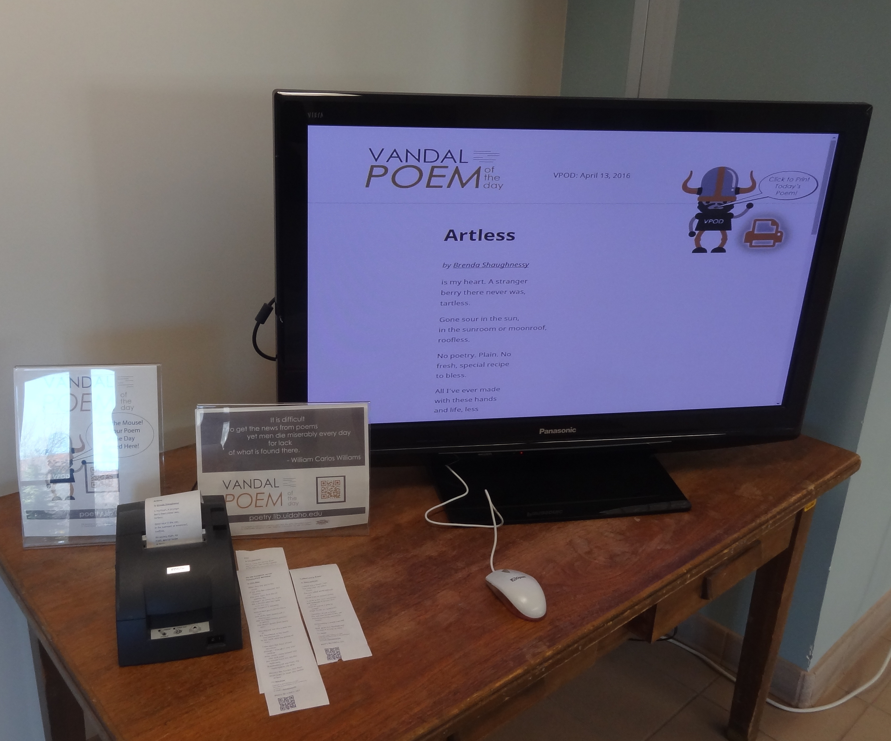

# kioskSlides

> simple, offline, html + js slideshow for display computer, that prints poems

Very basic slide show to replace PP on a display computer. HTML + JS allows interactive features in the slides including printing. KioskSlides uses an old, offline computer with only Chrome installed and an old POS receipt printer to create a interactive display.

## Background 

To promote our daily poetry website and have some fun, I attached an old POS receipt printer to our lobby display computer, allowing visitors to print poems. Rather than a looping PP slide deck, the kioskSlides is a set of HTML pages controlled by JS and run in Chrome kiosk mode offline. Adding print functionality is fairly easy using the standard drivers for the POS printer and Chrome's built in print function. A mouse is connected to the computer to allow visitors to interact with the slideshow. Right click is disabled and a keyboard is not connected to ensure simple security.    

## Mentions 

Here are some pictures of the printer, https://twitter.com/VandalPoem/status/694261911685181441

Mentioned in the student newspaper, https://www.uiargonaut.com/2016/02/25/the-poems-of-our-lives-the-vandal-poem-of-the-day-program-works-to-expose-students-to-wide-variety-of-poetry/

Mentioned in Vandal Poem of the Day Labs, http://poetry.lib.uidaho.edu/index.php/labs/

## Example

This respository contains an example implementation with three slide templates. The `poem.html` slide displays the daily poem or a random poem if their is no poem of the day and allows it to be printed (`randompoem.html` displays a random poem to read/print). The `fullSlide.html` and `photoSlide.html` templates are simple ways to display images, usually exported from traditional PP slide decks. The files contain extensive comments to explain usage. 

The slideshow is controlled by `advance.js`. The order of slides is given in the `slides` varible. Functions are provided to advance the slide after a set time or after mouse activity has stopped. 

## Set Up Chrome Kiosk Mode

After putting together the kioskSlides files, Chrome browser must be set up in kiosk mode on the display computer to run the slideshow. 

1. Set up printing defaults: 
..* set default printer to receipt
..* under more settings uncheck Headers and footers
2. Create a new Kiosk user and shortcut
..* settings > users > add new user > create shortcut for this user > create
3. Edit the shortcut to add flags enabling kiosk mode and printing without a message 
..* edit > properties > target
..* target should = `chrome.exe --kiosk --kiosk-printing http://[start URL here] --disable-print-preview`
4. Completely shut down Chrome (in task manager) or restart computer.

Start the slideshow by clicking on the shortcut.

To quit press Alt + F4 on keyboard. 

The kioskSlides can be left to run with a mouse attached, allowing visitors to interact with the slides. Right click is disabled on the slide pages, so if keyboard is disconnected there is no way to exit the kiosk show.

